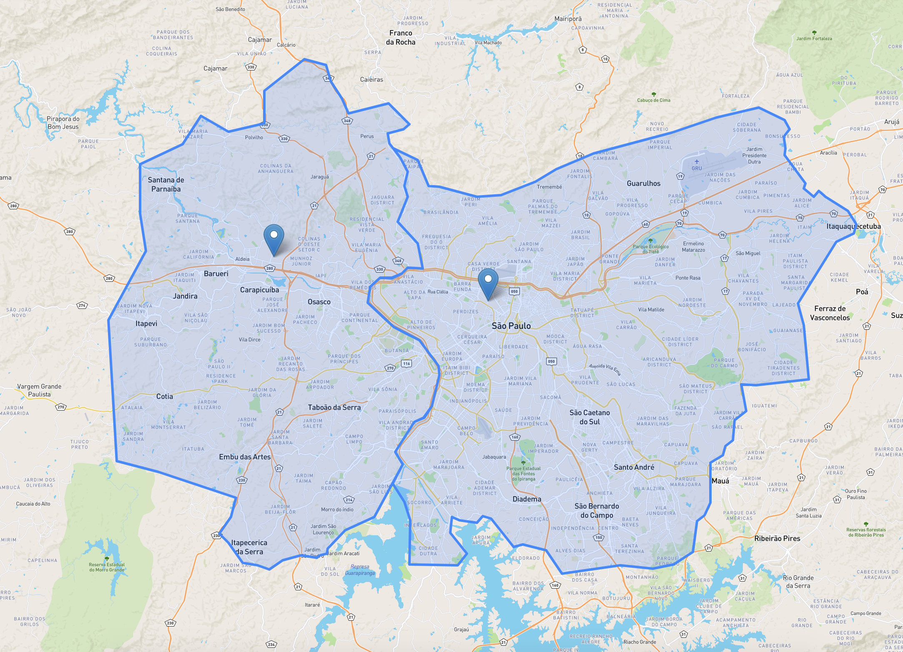

# Backend Challenge

## About the Challenge

In this [json](warehouses.json) you will find data about two warehouses with the following format:
```javascript
{
  "warehouses": [ 
    {
        "id": 1, 
        "name": "Warehouse Example",
        "coverage_area": { 
          "type": "Polygon", 
          "coordinates": [
                [
                    [30, 20],
                    [45, 40],
                    [10, 40],
                    [30, 20]
                ]
          ]
        }, // Coverage Area
        "address": { 
          "type": "Point",
          "coordinates": [-46.57421, -21.785741]
        } // Warehouse Location
    }
  ]
}
```

Below, you can give a look on how these warehouses might be represented in a map:



Before talking about the challenge itself, let me give you some information about the warehouses specifications:

We have some requirements that you must pay attention:

1. The `address` is defined by the format `GeoJSON Point` (https://en.wikipedia.org/wiki/GeoJSON)
2. The `coverage_area` is defined by the format `GeoJSON Polygon` (https://en.wikipedia.org/wiki/GeoJSON) 

## What we want you to do

Considering all the info we gave to you, we expect you to develop a service that provides API using REST and enable the following functionalities. The programming language is `Node.JS` and the database must be a `MySQL` or `PostgreSQL`. 

### 1. Create warehouse: 

All fields are required and must follow the rules set above.

### 2. Get warehouse by id:

Get a specific partner by its `id`.

### 3. Search warehouse:

Given a specific location (coordinates `lng` and `lat`), search the nearest warehouse considering each warehouses coverage area.

### 4. Tech Requirements, Docs and Deploy:

* Provide a documentation so we know how to execute your service locally and how to deploy it (*focus on simplicity, and don't forget that we should test your service on our own, without further assistance*)

## Evaluation Method

Your code will be under review of the Zx's Global Engineering team. What we will look for:
- **Performance**
- **Testing**
- **Maintanability**
- **Separation of concerns**
- **Software engineering**

## How to deliver it

Please, use Github to host your code.

**Once you have finished the challenge, please submit your information on this amazing form:**
  https://docs.google.com/forms/d/e/1FAIpQLSeUkQci7eHBb7SRM9oBGMrGfrzM24PGzsPoIKgW4UV1lC0hTQ/viewform

Good luck!